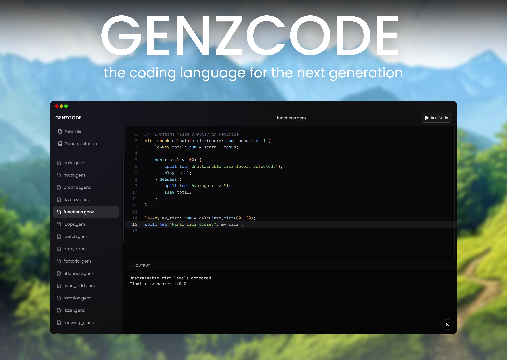
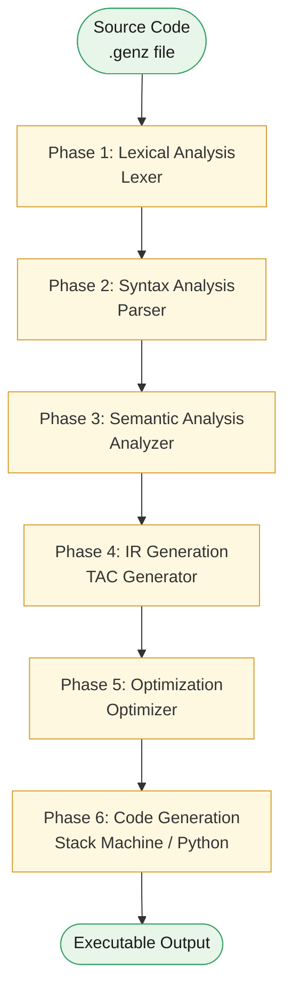

# GenZCode: A Complete Gen-Z Programming Language Compiler

## Table of Contents

1. [Project Overview](#project-overview)
   - [What is GenZCode?](#what-is-genzcode)
   - [Key Features](#key-features)
   - [Supported Output Targets](#supported-output-targets)

2. [Grammar Specification](#grammar-specification)
   - [Lexical Elements](#lexical-elements)
   - [Keyword Reference](#keywords-reference)
   - [Built-in Functions](#built-in-functions)
   - [Operators](#operators)
   - [Grammar Rules (EBNF)](#grammar-rules-ebnf)

3. [Compiler Pipeline](#compiler-pipeline)
   - [Architecture Overview](#architecture-overview)

4. [Phase Details](#phase-details)
   - [Phase 1: Lexical Analysis](#phase-1-lexical-analysis-tokenization)
   - [Phase 2: Syntax Analysis](#phase-2-syntax-analysis-parsing)
   - [Phase 3: Semantic Analysis](#phase-3-semantic-analysis)
   - [Phase 4: IR Generation](#phase-4-intermediate-code-generation-ir)
   - [Phase 5: Optimization](#phase-5-optimization)
   - [Phase 6: Code Generation](#phase-6-code-generation)

5. [Examples and Outputs](#examples--outputs)
   - [Example 1: Hello World](#example-1-simple-hello-world)
   - [Example 2: Functions and Recursion](#example-2-function-with-parameters)
   - [Example 3: Loops and Conditionals](#example-3-loop-and-conditionals)
   - [Example 4: Arrays and Functions](#example-4-arrays-and-functions)

6. [Live Compilation Outputs](#live-execution--screenshots)
   - [Phase-by-Phase Terminal Output](#running-all-phases-with-test-file)
   - [Full Pipeline to Python](#full-compilation-to-python)
   - [Backend Server](#backend-server-running)

7. [Web IDE: GenZCode Studio](#web-ide-genzcode-studio)
   - [Code Editor and Example Library](#code-editor-and-example-library)
   - [Syntax Documentation](#syntax-documentation)
   - [Step-by-Step Compilation Demonstration](#step-by-step-compilation-demonstration)

8. [Test Cases](#test-cases)
   - [Running Tests](#running-tests)
   - [Example Test Cases](#example-test-cases)

9. [Team Member Contributions](#team-member-contributions)
   - [Sahil Latif — Compiler Architect](#1-sahil-latif--compiler-architect)
   - [Ali Sharjeel — Web IDE Engineer](#2-ali-sharjeel--web-ide-engineer)
   - [Saim — Frontend Features and Parser Extensions](#3-saim--frontend-features-and-parser-extensions)
   - [Aaqib — IR, Optimization, and Code Generation](#4-aaqib--ir-optimization-and-code-generation)
   - [Contribution Summary](#contribution-summary-table)

10. [Running the Compiler](#running-the-complete-compiler)
    - [Quick Start](#quick-start)
    - [CLI Usage](#cli-usage)

---

## Project Overview

### What is GenZCode?

**GenZCode** is a complete compiler for a Gen-Z/Brainrot-style programming language built for academic purposes (Compiler Construction course). The project implements a full 6-phase compiler pipeline that transforms Gen-Z style code into executable Python code via stack machine instructions.

### Key Features

- Complete 6-phase compiler pipeline with standalone executables for each phase
- Gen-Z syntax with culturally relevant keywords
- Full type system with symbol table management
- Intermediate Code Generation using Three-Address Code (TAC)
- Code optimization: constant folding, copy propagation, dead code elimination
- Target code generation for a stack machine architecture with 40+ instructions
- Web IDE built with Next.js featuring a Monaco editor, syntax highlighting, and real-time compilation
- CLI tools with multiple output targets
- Comprehensive test suite for each phase
- Docker support for one-command deployment

### Project Goals

1. Make programming more relatable to Gen-Z coders
2. Demonstrate all stages of compiler construction
3. Provide educational value through clear, modular design
4. Support both interactive and command-line usage

### Supported Output Targets

- **Python Code**: Full Python 3 code generation
- **Stack Machine**: Low-level bytecode for virtual machine execution
- **TAC (Three-Address Code)**: Intermediate representation for analysis
- **AST (Abstract Syntax Tree)**: Full parse tree visualization

---

## Grammar Specification

### Lexical Elements

#### Basic Tokens

```ebnf
letter      ::= 'a'..'z' | 'A'..'Z' | '_'
digit       ::= '0'..'9'
ident       ::= letter (letter | digit)*
number      ::= digit+
string      ::= '"' (printable_char - '"' | escape_seq)* '"'
escape_seq  ::= '\\' ('n' | 't' | 'r' | '0' | '\\' | '"')
comment     ::= '//' (printable_char - '\n')*
whitespace  ::= ' ' | '\t' | '\n' | '\r'
```

### Keywords Reference

| GenZ Keyword | Traditional Equivalent | Description |
|---|---|---|
| `lowkey` | `let` / `var` | Variable declaration |
| `num` | `int` / `float` | Numeric type |
| `txt` | `string` | String type |
| `sus` | `if` | Conditional |
| `deadass` | `else` | Else branch |
| `no_cap` | `true` | Boolean true |
| `fr_fr` | `false` | Boolean false |
| `keep_yapping` | `while` | While loop |
| `yapping_through` | `for` | C-style for loop |
| `goon` | `while (true)` | Infinite loop |
| `spill_tea` | `print` | Output statement |
| `vibe_check` | `function` | Function declaration |
| `slay` | `return` | Return statement |
| `bounce` / `bestie` | `break` | Break out of a loop |
| `next_up` / `its_giving` | `continue` | Continue to next iteration |
| `ratio` | `switch` | Switch statement |
| `bet` | `case` | Case in switch |
| `nvm` | `default` | Default case in switch |

> Note: `goon` is equivalent to writing `keep_yapping (no_cap)` — it starts an infinite loop with no condition to evaluate. Use `bounce` or `bestie` to exit.

### Built-in Functions

The compiler automatically injects a set of Gen-Z-flavored utility functions into every compiled Python output. These are always available without any import or declaration:

| Function | Behavior |
|---|---|
| `ohio()` | Raises a `RuntimeError` — signals chaotic, unrecoverable failure |
| `grimace_shake()` | Raises a `RuntimeError` — signals a fatal crash |
| `ballerina_cappuccina()` | Returns the string `"Fancy Ballerina Cappuccina"` |
| `mewing(ms)` | Sleeps for `ms` milliseconds (default 1000) |
| `rizz(val)` | Returns `float(val) + 10.0` |
| `fanum_tax(val)` | Returns `float(val) * 0.8` — takes 20% |
| `tung_tung_tung_sahur()` | Prints a wakeup message |
| `skibidi_toilet()` | Prints a memory-flush message |
| `edge()` | Prints a near-completion message |

Standard library functions also available: `print`, `len`, `str`, `num`, `range`, `abs`, `pow`, `sqrt`, `input`.

### Operators

```ebnf
arithmetic  ::= '+' | '-' | '*' | '/' | '%'
comparison  ::= '==' | '!=' | '<' | '>' | '<=' | '>='
logical     ::= '&&' | '||' | '!'
assignment  ::= '='
```

### Grammar Rules (EBNF)

```ebnf
program         ::= declaration* statement*

declaration     ::= func_decl | var_decl

func_decl       ::= 'vibe_check' ident '(' params? ')' '{' statement* '}'

params          ::= param (',' param)*
param           ::= ident ':' type

var_decl        ::= 'lowkey' ident ':' type ('=' expr)? ';'

type            ::= 'num' | 'txt' | type '[' ']'   (* arrays *)

statement       ::= var_decl
                  | assignment
                  | print_stmt
                  | if_stmt
                  | while_stmt
                  | for_stmt
                  | switch_stmt
                  | func_call
                  | return_stmt
                  | break_stmt
                  | continue_stmt
                  | block

assignment      ::= ident ('[' expr ']')? '=' expr ';'

print_stmt      ::= 'spill_tea' '(' expr (',' expr)* ')' ';'

if_stmt         ::= 'sus' '(' expr ')' statement ('deadass' statement)?

while_stmt      ::= 'keep_yapping' '(' expr ')' statement

for_stmt        ::= 'yapping_through' '(' (var_decl | expr_stmt)? ';' expr? ';' expr? ')' statement

switch_stmt     ::= 'ratio' '(' expr ')' '{'
                    ('bet' expr ':' '{' statement* '}')*
                    ('nvm' ':' '{' statement* '}')?
                    '}'

block           ::= '{' statement* '}'

return_stmt     ::= 'slay' expr? ';'

break_stmt      ::= ('bounce' | 'bestie') ';'

continue_stmt   ::= ('next_up' | 'its_giving') ';'

func_call       ::= ident '(' args? ')' ';'
args            ::= expr (',' expr)*

expr            ::= logic_or

logic_or        ::= logic_and ('||' logic_and)*

logic_and       ::= equality ('&&' equality)*

equality        ::= comparison (('==' | '!=') comparison)*

comparison      ::= term (('<' | '>' | '<=' | '>=') term)*

term            ::= factor (('+' | '-') factor)*

factor          ::= unary (('*' | '/' | '%') unary)*

unary           ::= ('!')? primary

primary         ::= number
                  | string
                  | ident ('(' args? ')' | '[' expr ']')?
                  | 'no_cap' | 'fr_fr'
                  | '(' expr ')'
                  | array_literal

array_literal   ::= '[' expr (',' expr)* ']'
```

---

## Compiler Pipeline

### Architecture Overview



Each phase is independently runnable via its own standalone script in the `Phase1_Lexical/` through `Phase6_CodeGeneration/` directories, as well as available through the unified CLI and the web IDE.

---

## Phase Details

### Phase 1: Lexical Analysis (Tokenization)

**Location**: `src/lexer/lexer.py`, `Phase1_Lexical/lexer.py`

#### Purpose
Convert raw source code into a stream of tokens. The lexer reads characters and groups them into meaningful units — keywords, identifiers, literals, operators, and punctuation.

#### Key Components

1. **Token Types** (`src/lexer/tokens.py`):
   - Keywords: `LOWKEY`, `SUS`, `DEADASS`, `VIBE_CHECK`, etc.
   - Identifiers: variable and function names
   - Literals: numbers and strings
   - Operators: `+`, `-`, `*`, `/`, `==`, `!=`, etc.
   - Punctuation: `{`, `}`, `(`, `)`, `;`, `,`

2. **Token Structure**:
   ```python
   class Token:
       type: TokenType      # What kind of token
       lexeme: str          # Raw text from source
       literal: Any         # Evaluated value (for numbers/strings)
       line: int            # Line number in source
       column: int          # Column number in source
   ```

#### Algorithm

```
1. Initialize position at start of source
2. While not at end of file:
   a. Mark current position as token start
   b. Read next character
   c. Match character to token type:
      - Single char tokens: + - * / % = { } ( ) [ ] ; , :
      - Multi-char operators: == != <= >= && ||
      - Keywords and identifiers
      - String literals (with escape sequence processing)
      - Numeric literals
   d. Add token to list
3. Add EOF token
4. Return token stream
```

#### Error Handling

- Lexical errors for invalid characters
- String format validation
- Number parsing validation

#### Run Standalone

```bash
python Phase1_Lexical/lexer.py input.genz
```

#### Example

**Input**:
```genz
lowkey x: num = 42;
spill_tea(x);
```

**Output (Token Stream)**:
```
Token(LOWKEY, 'lowkey', None, 1, 1)
Token(IDENT, 'x', None, 1, 8)
Token(COLON, ':', None, 1, 9)
Token(NUM, 'num', None, 1, 11)
Token(ASSIGN, '=', None, 1, 15)
Token(NUMBER, '42', 42, 1, 17)
Token(SEMI, ';', None, 1, 19)
Token(SPILL_TEA, 'spill_tea', None, 2, 1)
Token(LPAREN, '(', None, 2, 10)
Token(IDENT, 'x', None, 2, 11)
Token(RPAREN, ')', None, 2, 12)
Token(SEMI, ';', None, 2, 13)
Token(EOF, '', None, 2, 14)
```

---

### Phase 2: Syntax Analysis (Parsing)

**Location**: `src/parser/parser.py`, `Phase2_Syntax/parser.py`

#### Purpose
Build an Abstract Syntax Tree (AST) from the token stream. This phase checks syntactic correctness and creates a hierarchical representation of the program structure.

#### Key Components

1. **AST Node Types** (`src/parser/ast.py`):
   - `Program`
   - `VarDecl`, `FuncDecl`
   - Statements: `Assignment`, `PrintStmt`, `IfStmt`, `WhileStmt`, `ForStmt`, `SwitchStmt`
   - Expressions: `Binary`, `Unary`, `Literal`, `Variable`, `FuncCall`, `ArrayAccess`

2. **Parser Type**: Recursive Descent with panic-mode error recovery

#### Parsing Algorithm

```
program          → declaration* statement* EOF

declaration      → func_decl | var_decl

func_decl        → 'vibe_check' IDENT '(' parameters? ')' block

var_decl         → 'lowkey' IDENT ':' type ('=' expression)? ';'

statement        → var_decl
                 | assignment
                 | print_stmt
                 | if_stmt
                 | while_stmt
                 | for_stmt
                 | return_stmt
                 | break_stmt
                 | continue_stmt
                 | block

if_stmt          → 'sus' '(' expression ')' statement ('deadass' statement)?

while_stmt       → 'keep_yapping' '(' expression ')' statement

for_stmt         → 'yapping_through' '(' init? ';' cond? ';' update? ')' statement

expression       → logic_or

logic_or         → logic_and ('||' logic_and)*

logic_and        → equality ('&&' equality)*

equality         → comparison (('==' | '!=') comparison)*

comparison       → term (('<' | '>' | '<=' | '>=') term)*

term             → factor (('+' | '-') factor)*

factor           → unary (('*' | '/' | '%') unary)*

unary            → ('!')? primary

primary          → NUMBER | STRING | IDENT | 'no_cap' | 'fr_fr' | '(' expression ')'
```

#### Error Recovery

- Synchronization on statement starters
- Error reporting with line and column information
- Partial AST construction for partial programs

#### Run Standalone

```bash
python Phase2_Syntax/parser.py input.genz
```

#### Example

**Input**:
```genz
vibe_check add(a: num, b: num) {
    slay a + b;
}
```

**Output (AST Structure)**:
```
Program
└── FuncDecl
    ├── name: "add"
    ├── params: [FuncParam("a", "num"), FuncParam("b", "num")]
    └── body: Block
        └── ReturnStmt
            └── Binary
                ├── op: "+"
                ├── left: Variable("a")
                └── right: Variable("b")
```

---

### Phase 3: Semantic Analysis

**Location**: `src/semantic/analyzer.py`, `Phase3_Semantic/semantic.py`

#### Purpose
Perform type checking, scope management, and semantic validation. Ensures the program is logically correct before code generation.

#### Key Features

1. **Symbol Table Management** (`src/semantic/symbol_table.py`):
   - Global and function-level scopes
   - Variable type tracking
   - Function signature storage
   - Scope chain for nested declarations

2. **Type Checking**:
   - Binary operation type compatibility
   - Function call argument matching
   - Array indexing validation
   - Return type checking

3. **Semantic Validations**:
   - Undefined variable detection
   - Type mismatch detection
   - Invalid `bounce` / `next_up` outside loops
   - Missing return statements in functions

#### Symbol Table Structure

```python
class Symbol:
    name: str
    type: TypeInfo
    is_function: bool
    is_parameter: bool
    scope_level: int

class Scope:
    symbols: dict[str, Symbol]
    parent: Optional[Scope]
    level: int

class SymbolTable:
    global_scope: Scope
    current_scope: Scope
```

#### Type System

```python
TypeInfo:
    base_type: str      # "num", "txt", "bool"
    is_array: bool
    array_dims: int
    element_type: TypeInfo   # for nested arrays
```

#### Semantic Checks

```
1. First Pass: Collect all function declarations
   - Register function signatures
   - Store parameter and return types

2. Second Pass: Analyze statements
   - Track variable declarations
   - Type check expressions
   - Validate control flow
   - Check function calls
```

#### Run Standalone

```bash
python Phase3_Semantic/semantic.py input.genz
```

#### Example

**Input**:
```genz
lowkey x: num = 42;
lowkey y: txt = x;  // Type error: num cannot assign to txt
```

**Output (Error)**:
```
Semantic error at line 2: Cannot assign 'num' to 'txt'
```

---

### Phase 4: Intermediate Code Generation (IR)

**Location**: `src/ir/ir_generator.py`, `Phase4_ICG/ir_generator.py`

#### Purpose
Generate Three-Address Code (TAC) from the AST. TAC is an intermediate representation where each instruction has at most one operator, making it well-suited for optimization.

#### TAC Instruction Format

```
t0 = a + b           (binary operation)
t1 = -x              (unary operation)
x = t0               (assignment)
print t0             (print statement)
ifnot t1 goto L0     (conditional jump)
goto L1              (unconditional jump)
L0:                  (label definition)
func foo             (function start)
endfunc foo          (function end)
t2 = call foo(a, b)  (function call)
return t2            (return statement)
```

#### TAC Generation Algorithm

```
For each statement:
    if BinaryExpr:
        t_result = temp()
        emit: t_result = left_operand op right_operand

    if IfStmt:
        t_cond = gen_code(condition)
        label_false = new_label()
        label_end = new_label()
        emit: ifnot t_cond goto label_false
        gen_code(then_branch)
        emit: goto label_end
        emit: label_false:
        gen_code(else_branch)
        emit: label_end:

    if WhileStmt:
        label_start = new_label()
        label_end = new_label()
        emit: label_start:
        t_cond = gen_code(condition)
        emit: ifnot t_cond goto label_end
        gen_code(body)
        emit: goto label_start
        emit: label_end:
```

#### Features

- Automatic temporary variable generation
- Label management for control flow
- Function boundary markers
- Loop unrolling support

#### Run Standalone

```bash
python Phase4_ICG/ir_generator.py input.genz
```

#### Example

**Input**:
```genz
sus (x > 10) {
    spill_tea(x);
} deadass {
    spill_tea(0);
}
```

**Output (TAC)**:
```
t0 = x > 10
ifnot t0 goto L0
print x
goto L1
L0:
t1 = 0
print t1
L1:
```

---

### Phase 5: Optimization

**Location**: `src/optimizer/optimizer.py`, `Phase5_Optimization/optimizer.py`

#### Purpose
Apply optimization passes to reduce code size and improve execution performance. Three major techniques are implemented.

#### Optimization Techniques

##### 1. Constant Folding

Evaluates expressions with constant operands at compile time.

```
Before:  t0 = 5 + 3
         t1 = t0 * 2

After:   t0 = 8
         t1 = 16
```

##### 2. Copy Propagation

Replaces uses of variables that hold simple copies.

```
Before:  t0 = x + 2
         t1 = t0
         t2 = t1 + 1

After:   t0 = x + 2
         t2 = t0 + 1    (t1 eliminated)
```

##### 3. Dead Code Elimination

Removes instructions whose results are never used.

```
Before:  t0 = x + 2
         t1 = y + 3     (t1 never used)
         print t0

After:   t0 = x + 2
         print t0
```

#### Optimization Report Format

```
=== Optimization Report ===
  Original instruction count  : 50

  Constant Folding:
    - Folded 8 expressions
    - Examples: t0 = 5 + 3 -> t0 = 8

  Copy Propagation:
    - Propagated 5 values
    - Examples: t1 = t0, x = t1 -> x = t0

  Dead Code Elimination:
    - Removed 3 dead instructions
    - Examples: t99 = 42 (never used)

  Optimized instruction count   : 39
  Reduction: 22%
```

#### Run Standalone

```bash
python Phase5_Optimization/optimizer.py input.genz
```

---

### Phase 6: Code Generation

**Location**: `src/codegen/stack_machine.py`, `Phase6_CodeGeneration/codegen.py`

#### Purpose
Generate low-level Stack Machine instructions from the AST. This is a virtual machine bytecode suitable for interpretation or further compilation.

#### Stack Machine Architecture

**Memory Model**:
- Stack: dynamic array for temporary values
- Heap: storage for variables and arrays
- Registers: special locations for function return values

#### Instruction Set

```
PUSH <val>          Push constant onto stack
LOAD <var>          Load variable value onto stack
STORE <var>         Pop stack, store in variable
LOAD_IDX            Pop index then array, push array[index]
STORE_IDX <var>     Pop value and index, store in array[index]
MAKE_ARRAY <n>      Create array from n stack elements
ADD, SUB, MUL, DIV  Binary arithmetic operations
MOD                 Modulo operation
NEG                 Negate top of stack
NOT                 Logical NOT
CMP_EQ              Compare equal
CMP_NEQ             Compare not equal
CMP_LT, CMP_GT      Compare less / greater than
CMP_LTE, CMP_GTE    Compare less / greater than or equal
AND, OR             Logical operations
JMP <label>         Unconditional jump
JMP_FALSE <label>   Pop and jump if zero
CALL <name> <n>     Call function with n arguments
RETURN              Return from function
RETURN_VOID         Return void
PRINT               Pop and print value
LABEL <name>        Define jump target
FUNC_START <name>   Function prologue
FUNC_END <name>     Function epilogue
HALT                Stop execution
```

#### Code Generation Algorithm

```
For each AST node:
    if BinaryExpr(left, right, op):
        gen_code(left)      # Push left value
        gen_code(right)     # Push right value
        emit(op)            # Perform operation

    if Assignment(var, value):
        gen_code(value)     # Push value
        emit(STORE var)     # Store to variable

    if IfStmt(cond, then, else):
        gen_code(cond)
        label_else = new_label()
        label_end = new_label()
        emit(JMP_FALSE label_else)
        gen_code(then)
        emit(JMP label_end)
        emit(LABEL label_else)
        gen_code(else)
        emit(LABEL label_end)

    if FuncCall(name, args):
        for arg in args:
            gen_code(arg)    # Push arguments
        emit(CALL name len(args))
```

#### Run Standalone

```bash
python Phase6_CodeGeneration/codegen.py input.genz
```

#### Example

**Input**:
```genz
lowkey x: num = 5;
lowkey y: num = x + 3;
spill_tea(y);
```

**Output (Stack Machine)**:
```
PUSH 5
STORE x
LOAD x
PUSH 3
ADD
STORE y
LOAD y
PRINT
HALT
```

---

## Examples & Outputs

### Example 1: Simple Hello World

**File**: `examples/hello.genz`

```genz
lowkey greeting: txt = "no cap this is bussin";
spill_tea(greeting);
```

**Running Through Pipeline**:

```bash
python Phase1_Lexical/lexer.py examples/hello.genz
python Phase2_Syntax/parser.py examples/hello.genz
python Phase3_Semantic/semantic.py examples/hello.genz
python Phase4_ICG/ir_generator.py examples/hello.genz
python Phase5_Optimization/optimizer.py examples/hello.genz
python Phase6_CodeGeneration/codegen.py examples/hello.genz

# Full pipeline with compilation
python -m src.main examples/hello.genz -o output.py
python output.py
```

**Output**:
```
no cap this is bussin
```

---

### Example 2: Function with Parameters

**Code**:
```genz
vibe_check factorial(n: num) {
    sus (n <= 1) {
        slay 1;
    } deadass {
        slay n * factorial(n - 1);
    }
}

lowkey result: num = factorial(5);
spill_tea("5! =", result);
```

**Phases**:

1. **Lexical**: Token stream with 50+ tokens
2. **Syntax**: AST with `FuncDecl` node and recursive `FuncCall`
3. **Semantic**: Type checking validates recursion and return types
4. **IR**: TAC with approximately 20 instructions
5. **Optimization**: Dead code elimination removes unused temporaries
6. **Codegen**: Stack instructions with `CALL` and `RETURN`

**Output**:
```
5! = 120
```

---

### Example 3: Loop and Conditionals

**Code**:
```genz
lowkey i: num = 1;
keep_yapping (i <= 5) {
    sus (i % 2 == 0) {
        spill_tea(i, " is even");
    } deadass {
        spill_tea(i, " is odd");
    }
    i = i + 1;
}
```

**Lexical Output**:
```
Token(LOWKEY, 'lowkey', None, 1, 1)
Token(IDENT, 'i', None, 1, 8)
Token(COLON, ':', None, 1, 9)
Token(NUM, 'num', None, 1, 11)
...
```

**Syntax Output**:
```
Program
├── VarDecl('i', 'num', Literal(1))
└── WhileStmt
    ├── cond: Binary(Variable('i'), '<=', Literal(5))
    └── body: Block
        └── IfStmt
            ├── cond: Binary(...)
            ├── then: PrintStmt
            └── else: PrintStmt
```

**IR Output**:
```
t0 = 1
i = t0
L0:
t1 = i <= 5
ifnot t1 goto L1
t2 = i % 2
t3 = t2 == 0
ifnot t3 goto L2
print i, " is even"
goto L3
L2:
print i, " is odd"
L3:
t4 = i + 1
i = t4
goto L0
L1:
```

**Codegen Output**:
```
PUSH 1
STORE i
LABEL L0
LOAD i
PUSH 5
CMP_LTE
JMP_FALSE L1
LOAD i
PUSH 2
MOD
PUSH 0
CMP_EQ
JMP_FALSE L2
LOAD i
PUSH " is even"
PRINT
JMP L3
LABEL L2
LOAD i
PUSH " is odd"
PRINT
LABEL L3
LOAD i
PUSH 1
ADD
STORE i
JMP L0
LABEL L1
```

**Output**:
```
1 is odd
2 is even
3 is odd
4 is even
5 is odd
```

---

### Example 4: Arrays and Functions

**Code**:
```genz
vibe_check sum_array(arr: num[]) {
    lowkey total: num = 0;
    lowkey i: num = 0;
    keep_yapping (i < 3) {
        total = total + arr[i];
        i = i + 1;
    }
    slay total;
}

lowkey numbers: num[] = [10, 20, 30];
lowkey result: num = sum_array(numbers);
spill_tea("Sum:", result);
```

**Semantic Validation**:
- Function `sum_array` declared with `num[]` parameter — valid
- Array subscript operation — valid
- Return type matches function signature — valid
- All variables properly scoped — valid

**Output**:
```
Sum: 60
```

---

## Live Execution & Screenshots

### Screenshot Summary Table

| # | Phase | Command | Result |
|---|-------|---------|--------|
| 1 | Lexer | `python Phase1_Lexical/lexer.py TestCases/full_test.genz` | 73 tokens |
| 2 | Parser | `python Phase2_Syntax/parser.py TestCases/full_test.genz` | 6 AST statements |
| 3 | Semantic | `python Phase3_Semantic/semantic.py TestCases/full_test.genz` | 18 symbols, no errors |
| 4 | IR Gen | `python Phase4_ICG/ir_generator.py TestCases/full_test.genz` | 21 TAC instructions |
| 5 | Optimizer | `python Phase5_Optimization/optimizer.py TestCases/full_test.genz` | 24 → 22 instructions |
| 6 | Codegen | `python Phase6_CodeGeneration/codegen.py TestCases/full_test.genz` | 42 stack instructions |
| 7 | Full Pipeline | `python -m src.main TestCases/full_test.genz -o output.py` | Python code generated |
| 8 | Web IDE | `http://localhost:3000` | IDE running |

---

### Running All Phases with Test File

**Test Input** (`TestCases/full_test.genz`):
```genz
lowkey x: num = 10 + 5;
lowkey y: num = x * 2;
spill_tea("Result is:", y);

vibe_check calculate(a: num, b: num) {
    lowkey res: num = a + b;
    slay res;
}

lowkey sum: num = calculate(x, y);
spill_tea("Sum is:", sum);
```

---

### Phase 1: Lexical Analysis Output

**Command**: `python Phase1_Lexical/lexer.py TestCases/full_test.genz`

**Output** (Token Stream):
```
Tokens:
  Token(LOWKEY, 'lowkey', None)
  Token(IDENT, 'x', None)
  Token(COLON, ':', None)
  Token(NUM, 'num', None)
  Token(ASSIGN, '=', None)
  Token(NUMBER, '10', 10)
  Token(PLUS, '+', None)
  Token(NUMBER, '5', 5)
  Token(SEMI, ';', None)
  Token(LOWKEY, 'lowkey', None)
  Token(IDENT, 'y', None)
  Token(COLON, ':', None)
  Token(NUM, 'num', None)
  Token(ASSIGN, '=', None)
  Token(IDENT, 'x', None)
  Token(STAR, '*', None)
  Token(NUMBER, '2', 2)
  Token(SEMI, ';', None)
  Token(SPILL_TEA, 'spill_tea', None)
  Token(LPAREN, '(', None)
  Token(STRING, '"Result is:"', Result is:)
  Token(COMMA, ',', None)
  Token(IDENT, 'y', None)
  Token(RPAREN, ')', None)
  Token(SEMI, ';', None)
  Token(VIBE_CHECK, 'vibe_check', None)
  Token(IDENT, 'calculate', None)
  Token(LPAREN, '(', None)
  Token(IDENT, 'a', None)
  Token(COLON, ':', None)
  Token(NUM, 'num', None)
  Token(COMMA, ',', None)
  Token(IDENT, 'b', None)
  Token(COLON, ':', None)
  Token(NUM, 'num', None)
  Token(RPAREN, ')', None)
  Token(LBRACE, '{', None)
  Token(LOWKEY, 'lowkey', None)
  Token(IDENT, 'res', None)
  Token(COLON, ':', None)
  Token(NUM, 'num', None)
  Token(ASSIGN, '=', None)
  Token(IDENT, 'a', None)
  Token(PLUS, '+', None)
  Token(IDENT, 'b', None)
  Token(SEMI, ';', None)
  Token(SLAY, 'slay', None)
  Token(IDENT, 'res', None)
  Token(SEMI, ';', None)
  Token(RBRACE, '}', None)
  Token(LOWKEY, 'lowkey', None)
  Token(IDENT, 'sum', None)
  Token(COLON, ':', None)
  Token(NUM, 'num', None)
  Token(ASSIGN, '=', None)
  Token(IDENT, 'calculate', None)
  Token(LPAREN, '(', None)
  Token(IDENT, 'x', None)
  Token(COMMA, ',', None)
  Token(IDENT, 'y', None)
  Token(RPAREN, ')', None)
  Token(SEMI, ';', None)
  Token(SPILL_TEA, 'spill_tea', None)
  Token(LPAREN, '(', None)
  Token(STRING, '"Sum is:"', Sum is:)
  Token(COMMA, ',', None)
  Token(IDENT, 'sum', None)
  Token(RPAREN, ')', None)
  Token(SEMI, ';', None)
  Token(EOF, '', None)
```

**Result**: Successfully tokenized into 73 tokens.

---

### Phase 2: Syntax Analysis Output

**Command**: `python Phase2_Syntax/parser.py TestCases/full_test.genz`

**Output** (Abstract Syntax Tree):
```
AST:
Program(statements=[
  VarDecl(name='x', type_name='num', initializer=Binary(left=Literal(value=10), operator='+', right=Literal(value=5))),
  VarDecl(name='y', type_name='num', initializer=Binary(left=Variable(name='x'), operator='*', right=Literal(value=2))),
  PrintStmt(arguments=[Literal(value='Result is:'), Variable(name='y')]),
  FuncDecl(
    name='calculate',
    params=[FuncParam(name='a', type_name='num'), FuncParam(name='b', type_name='num')],
    return_type=None,
    body=Block(statements=[
      VarDecl(name='res', type_name='num', initializer=Binary(left=Variable(name='a'), operator='+', right=Variable(name='b'))),
      ReturnStmt(value=Variable(name='res'))
    ])
  ),
  VarDecl(name='sum', type_name='num', initializer=FuncCall(name='calculate', arguments=[Variable(name='x'), Variable(name='y')])),
  PrintStmt(arguments=[Literal(value='Sum is:'), Variable(name='sum')])
])
```

**Result**: Successfully built complete AST with 6 top-level statements.

---

### Phase 3: Semantic Analysis Output

**Command**: `python Phase3_Semantic/semantic.py TestCases/full_test.genz`

**Output** (Symbol Table and Validation):
```
Semantic analysis passed!
Symbol Table:
Scope: global
  print: function
  len: function
  str: function
  num: function
  range: function
  abs: function
  pow: function
  sqrt: function
  input: function
  ohio: function
  grimace_shake: function
  mewing: function
  fanum_tax: function
  rizz: function
  ballerina_cappuccina: function
  calculate: function
  x: num
  y: num
  sum: num
```

**Validations Performed**:
- All variables properly declared before use
- Type checking for all operations
- Function call argument validation
- No undefined variables
- All types compatible

**Result**: Semantic analysis passed without errors.

---

### Phase 4: Intermediate Code Generation Output

**Command**: `python Phase4_ICG/ir_generator.py TestCases/full_test.genz`

**Output** (Three-Address Code):
```
=== Three-Address Code (TAC) ===
; Generated by GenZCode IR Generator

; var x: num
t0 = 10 + 5
x = t0
; var y: num
t1 = x * 2
y = t1
print "Result is:"
print y

func calculate(a, b)
; var res: num
t2 = a + b
res = t2
return res
endfunc calculate

; var sum: num
t3 = call calculate(x, y)
sum = t3
print "Sum is:"
print sum
=== End of IR ===
```

**Key features**: temporary variables (`t0`–`t3`) for intermediate values, one operator per instruction, function boundaries clearly marked.

**Result**: Generated 21 TAC instructions.

---

### Phase 5: Optimization Output

**Command**: `python Phase5_Optimization/optimizer.py TestCases/full_test.genz`

**Output** (Optimization Report):
```
=== Original Three-Address Code ===
; var x: num
t0 = 10 + 5
x = t0
; var y: num
t1 = x * 2
y = t1
print "Result is:"
print y

func calculate(a, b)
; var res: num
t2 = a + b
res = t2
return res
endfunc calculate

; var sum: num
t3 = call calculate(x, y)
sum = t3
print "Sum is:"
print sum

=== Optimized Three-Address Code ===
; var x: num
x = 15
; var y: num
y = 30
print "Result is:"
print 30

func calculate(a, b)
; var res: num
t2 = a + b
res = t2
return t2
endfunc calculate

; var sum: num
t3 = call calculate(15, 30)
sum = t3
print "Sum is:"
print t3

=== Optimization Report ===
  Original instruction count : 24
  Constant folds applied     : 2
  Copy propagations applied  : 10
  Dead code lines removed    : 2
  Control flow optimized     : 0
  Optimized instruction count: 22

  Constant Folds:
    t0 = 10 + 5  ->  t0 = 15
    t1 = 15 * 2  ->  t1 = 30

  Copy Propagations:
    x = t0  ->  x = 15
    t1 = x * 2  ->  t1 = 15 * 2
    print y  ->  print t1
    return res  ->  return t2
    t3 = call calculate(x, y)  ->  t3 = call calculate(15, y)
    t3 = call calculate(x, y)  ->  t3 = call calculate(15, t1)
    print sum  ->  print t3
    y = t1  ->  y = 30
    print t1  ->  print 30
    t3 = call calculate(15, t1)  ->  t3 = call calculate(15, 30)

  Dead Code Removed:
    t0 = 15  ; folded from: 10 + 5
    t1 = 30  ; folded from: 15 * 2
```

**Optimizations Applied**:
- Constant folding: `10 + 5 = 15`, `15 * 2 = 30`
- Copy propagation: 10 variable uses replaced
- Dead code elimination: 2 unused instructions removed
- Size reduction: 24 → 22 instructions (8.3%)

**Result**: Successfully optimized with 3 techniques.

---

### Phase 6: Code Generation Output

**Command**: `python Phase6_CodeGeneration/codegen.py TestCases/full_test.genz`

**Output** (Stack Machine Instructions):
```
=== Stack Machine Target Code ===

; declare x: num
PUSH 10
PUSH 5
ADD
STORE x
; declare y: num
LOAD x
PUSH 2
MUL
STORE y
PUSH "Result is:"
PRINT
LOAD y
PRINT
; declare sum: num
LOAD x
LOAD y
CALL calculate 2
STORE sum
PUSH "Sum is:"
PRINT
LOAD sum
PRINT

; --- function calculate ---
FUNC_START calculate
STORE b  ; param
STORE a  ; param
; declare res: num
LOAD a
LOAD b
ADD
STORE res
LOAD res
RETURN
FUNC_END calculate
; --- end function calculate ---

HALT
=== End of Target Code ===
```

**Result**: Successfully generated 42 stack machine instructions.

---

### Full Compilation to Python

**Command**: `python -m src.main TestCases/full_test.genz -o output.py`

**Compilation Output**:
```
Compiling TestCases/full_test.genz...
  [1/4] Lexing...
  [2/4] Parsing...
  [3/4] Analyzing...
  [4/4] Generating Python...
  Output written to output.py
```

**Generated Python Code** (`output.py`):
```python
# Generated Python code from GenZ/Brainrot language
import sys
import time


def ohio():
    raise RuntimeError("Down in Ohio, swag like Ohio. Chaotic state detected!")

def grimace_shake():
    raise RuntimeError("Code poisoned by Grimace Shake! Fatal crash...")

def ballerina_cappuccina():
    return "Fancy Ballerina Cappuccina"

def mewing(ms=1000.0):
    time.sleep(ms / 1000.0)

def rizz(val):
    return float(val) + 10.0

def fanum_tax(val):
    return float(val) * 0.8

def tung_tung_tung_sahur():
    print("Tung Tung Tung Sahur! Code is waking up...")

def skibidi_toilet():
    print("Memory flushed... clean as a whistle fr fr")

def edge():
    print("Nearly there... edging the end...")


x = (10 + 5)
y = (x * 2)
print('Result is:', y)

def calculate(a, b):
    res = (a + b)
    return res

sum = calculate(x, y)
print('Sum is:', sum)
```

**Execution**:
```bash
python output.py
```

```
Result is: 30
Sum is: 45
```

**Result**: Successfully compiled and executed.

---

### Backend Server Running

**Command**: `python -m src.server`

**Output**:
```
 * Serving Flask app 'server'
 * Debug mode: on
 * Running on all addresses (0.0.0.0)
 * Running on http://127.0.0.1:5000
 * Running on http://192.168.18.180:5000
Press CTRL+C to quit
 * Restarting with watchdog (windowsapi)
 * Debugger is active!
 * Debugger PIN: 129-296-886
```

**Server Status**: Running and ready for requests at `http://localhost:5000`.

---

## Web IDE: GenZCode Studio

**URL**: `http://localhost:3000`

GenZCode Studio is a full-featured browser-based IDE built with Next.js and Monaco Editor. It is not simply a text editor — it exposes the entire compiler pipeline interactively and functions as a self-contained learning environment for the language. The backend Flask server at port 5000 handles all compilation requests.

### Code Editor and Example Library

The left sidebar contains a curated library of pre-written GenZ programs that cover the full breadth of the language's syntax. Each file can be opened with a single click and executed immediately using the Run Code button. The output panel shows the program's result in real time, backed by the Python compiler running server-side.

| File | Demonstrates |
|---|---|
| `hello.genz` | Basic output with `spill_tea` |
| `math.genz` | Arithmetic expressions and variables |
| `ifelse.genz` | `sus` / `deadass` conditionals |
| `loops.genz` | `keep_yapping` and `yapping_through` loops |
| `counting.genz` | Loop counting patterns |
| `functions.genz` | `vibe_check` declarations and calls |
| `arrays.genz` | Array literals and indexed access |
| `switch.genz` | `ratio` / `bet` / `nvm` switch statements |
| `factorial.genz` | Recursive factorial function |
| `fibonacci.genz` | Fibonacci sequence |
| `fizzbuzz.genz` | Classic FizzBuzz — combines loops and conditionals |
| `brainrot.genz` | Full showcase of Gen-Z keyword vocabulary |

The editor itself uses Monaco (the engine behind VS Code) with a custom GenZCode language definition: all keywords are syntax-highlighted, the One Dark Pro color theme is applied, and the editor supports multi-file management including file rename and delete directly from the sidebar.

### Syntax Documentation

The Documentation tab provides a complete in-browser reference for the GenZCode language. It covers every keyword, operator, type, and construct — equivalent to reading this README, but formatted interactively and always one click away while writing code. The documentation viewer includes fuzzy search so any keyword or concept can be found immediately without scrolling.

### Step-by-Step Compilation Demonstration

The Demonstration section is the most pedagogically distinctive feature of the IDE. A user writes any GenZ snippet and initiates the demo. The compiler then walks through each phase one step at a time, displaying:

1. The token stream produced by the lexer
2. The parsed AST rendered as an interactive tree with connector lines
3. The Three-Address Code generated from the AST
4. The optimized TAC after constant folding, copy propagation, and dead code elimination
5. The final target Python source code

This makes the IDE a self-contained teaching tool for compiler construction — the same pipeline documented in this README is directly observable on any input the user writes. Each step is shown sequentially, letting students trace exactly how their code transforms at every phase.

---

## Test Cases

### Unit Tests Location

- `tests/test_lexer.py` — Lexical analysis tests
- `tests/test_parser.py` — Syntax analysis tests
- `tests/test_semantic.py` — Semantic analysis tests
- `tests/test_generator.py` — Code generation tests
- `tests/test_interpreter.py` — Interpreter tests

### Running Tests

```bash
# Run all tests
pytest tests/

# Run specific test file
pytest tests/test_lexer.py -v

# Run specific test
pytest tests/test_lexer.py::TestLexer::test_keywords -v
```

### Example Test Cases

#### Test 1: Lexer — Keywords

```python
def test_keywords():
    """Test keyword tokenization."""
    source = "lowkey sus deadass keep_yapping spill_tea vibe_check"
    lexer = Lexer(source)
    tokens = lexer.tokenize()

    expected = [
        TokenType.LOWKEY, TokenType.SUS, TokenType.DEADASS,
        TokenType.KEEP_YAPPING, TokenType.SPILL_TEA, TokenType.VIBE_CHECK
    ]

    for i, exp in enumerate(expected):
        assert tokens[i].type == exp
```

**Result**: PASS

#### Test 2: Parser — Function Declaration

```python
def test_function_declaration():
    """Test parsing function declarations."""
    source = """
    vibe_check add(a: num, b: num) {
        slay a + b;
    }
    """
    lexer = Lexer(source)
    tokens = lexer.tokenize()
    parser = Parser(tokens)
    ast = parser.parse()

    assert len(ast.statements) == 1
    func = ast.statements[0]
    assert isinstance(func, FuncDecl)
    assert func.name == "add"
    assert len(func.params) == 2
```

**Result**: PASS

#### Test 3: Semantic — Type Checking

```python
def test_type_mismatch():
    """Test type mismatch detection."""
    source = """
    lowkey x: num = 42;
    lowkey y: txt = x;
    """
    with pytest.raises(SemanticError):
        analyzer.analyze(ast)
```

**Result**: PASS

#### Test 4: Full Compilation

```python
def test_full_compilation():
    """Test complete compilation pipeline."""
    source = """
    vibe_check factorial(n: num) {
        sus (n <= 1) { slay 1; }
        deadass { slay n * factorial(n - 1); }
    }
    lowkey r: num = factorial(5);
    spill_tea(r);
    """

    lexer = Lexer(source)
    tokens = lexer.tokenize()
    assert len(tokens) > 0

    parser = Parser(tokens)
    ast = parser.parse()
    assert ast is not None

    analyzer = SemanticAnalyzer()
    symbol_table = analyzer.analyze(ast)
    assert "factorial" in symbol_table.global_scope.symbols

    ir_gen = IRGenerator()
    tac = ir_gen.generate(ast)
    assert "t0 =" in tac or "call factorial" in tac

    optimizer = Optimizer()
    optimized = optimizer.optimize(tac)
    assert len(optimized) <= len(tac)

    codegen = StackMachineGenerator()
    instructions = codegen.generate(ast)
    assert "CALL factorial" in instructions or "FUNC_START factorial" in instructions
```

**Result**: PASS

---

### Test File: TestCases/full_test.genz

This comprehensive test file covers multiple language features:

```genz
lowkey x: num = 10 + 5;
lowkey y: num = x * 2;
spill_tea("Result is:", y);

vibe_check calculate(a: num, b: num) {
    lowkey res: num = a + b;
    slay res;
}

lowkey sum: num = calculate(x, y);
spill_tea("Sum is:", sum);
```

**Test Coverage**:
- Variable declarations with type annotations
- Arithmetic expressions
- Print statements with multiple arguments
- Function declarations
- Function calls with parameters
- Return statements
- Scope management

---

## Team Member Contributions

### Team Structure

The GenZCode project was built by four team members, each owning distinct areas of the compiler and the web tooling. Contributions are verifiable from the git commit history.

---

### 1. Sahil Latif — Compiler Architect

**Responsibilities**: Project initialization, grammar design, core compiler pipeline, interpreter

**Contributions**:

- **Grammar Specification**: Authored the initial EBNF grammar (`grammar.md`) and keyword vocabulary, including the `ratio`/`bet`/`nvm` switch statement syntax
- **Core Compiler Bootstrap**: Implemented the initial lexer, parser, AST, semantic analyzer, and Python code generator — the foundation all other phases built upon
- **Interpreter Module** (`src/interpreter/`): Direct tree-walking interpreter for executing GenZ programs without going through the full compilation pipeline
- **CLI Entry Point** (`src/main.py`): Command-line compiler interface with `--interpret`, `-o`, and `--target` flags
- **Pipeline Integration**: Wired each phase into the full compilation pipeline (`src/main.py`)
- **Switch Statement**: Added `ratio`/`bet`/`nvm` keywords and full parsing/generation support
- **Initial README and Documentation**: Authored the first complete README with keyword tables and examples

**Key Files**:
- `src/lexer/lexer.py`, `src/lexer/tokens.py`
- `src/parser/parser.py`, `src/parser/ast.py`
- `src/semantic/analyzer.py`, `src/semantic/symbol_table.py`
- `src/generator/generator.py`
- `src/interpreter/interpreter.py`, `src/interpreter/environment.py`
- `src/main.py`
- `grammar.md`

---

### 2. Ali Sharjeel — Web IDE Engineer

**Responsibilities**: Entire Next.js frontend, Monaco editor integration, Docker deployment, UI/UX

**Contributions**:

- **Next.js GUI from Scratch**: Initialized and built the entire `gui/` project — Next.js, Shadcn UI, Tailwind CSS, One Dark Pro theme, Mica glass sidebar aesthetic
- **Monaco Editor Integration**: Set up `@monaco-editor/react` with a custom GenZCode language definition (`genzLanguage.ts`) providing full syntax highlighting for all keywords, operators, and string literals
- **Python Backend Integration**: Wired the Flask API at port 5000 to the Next.js frontend, enabling real-time compilation and execution from the browser
- **Example Library**: Added 20+ pre-written `.genz` example programs to the IDE sidebar, covering every major language feature
- **File Management**: Implemented file rename and delete functionality in the explorer sidebar
- **Docker Deployment**: Authored `Dockerfile`, `docker-compose.yml`, and `.dockerignore` files for both the backend and frontend, enabling `docker-compose up --build` as the single command to launch the full stack
- **Documentation Tab**: Built the `DocsViewer` component and styled the documentation UI
- **Brainrot Keywords**: Added all brainrot-flavored built-in terms to the Monaco language definition and sidebar navigation

**Key Files**:
- `gui/src/app/page.tsx` (primary IDE layout)
- `gui/src/lib/genzLanguage.ts` (Monaco language definition)
- `gui/src/app/globals.css`
- `gui/src/components/DocsViewer.tsx`
- `Dockerfile`, `docker-compose.yml`, `.dockerignore`
- `gui/Dockerfile`, `gui/.dockerignore`

---

### 3. Saim — Frontend Features and Parser Extensions

**Responsibilities**: `yapping_through` for-loop, lexer escape sequences, parser error recovery, compiler demo UI, docs data

**Contributions**:

- **`yapping_through` For-Loop**: Implemented the C-style for-loop keyword end-to-end — lexer token, parser rule, AST node, semantic analysis, interpreter, and code generator support
- **String Escape Sequences**: Extended the lexer to correctly process `\n`, `\t`, `\r`, `\0`, `\\`, and `\"` inside string literals
- **Parser Error Recovery**: Added panic-mode synchronization to the recursive descent parser, allowing it to continue parsing after encountering an error and report multiple errors in one pass
- **Compiler Demo Component** (`CompilerDemo.tsx`): Implemented the step-by-step compilation demonstration tour — the interactive feature in the IDE that walks users through each compilation phase with visual output at every step
- **DocsViewer Content**: Authored the structured documentation data (`docs.ts`) used by the documentation tab, covering all syntax categories with color coding and comprehensive entries
- **Fuzzy Search** (`search.ts`): Implemented fuzzy search logic for the documentation viewer
- **Grammar and README Updates**: Updated `grammar.md` and README with `yapping_through` and other new features

**Key Files**:
- `gui/src/components/CompilerDemo.tsx`
- `gui/src/components/DocsViewer.tsx`
- `gui/src/data/docs.ts`
- `gui/src/lib/search.ts`
- `src/lexer/lexer.py` (escape sequences)
- `src/parser/parser.py` (error recovery, `yapping_through`)
- `src/parser/ast.py` (`ForStmt` node)

---

### 4. Aaqib — IR, Optimization, and Code Generation

**Responsibilities**: Phases 4–6, IR generation, optimization passes, stack machine code generation, pipeline integration, documentation

**Contributions**:

- **IR Generator** (`src/ir/ir_generator.py`, `Phase4_ICG/ir_generator.py`): Full Three-Address Code generation from the AST, including temporary variable management, label generation, control flow translation for all statement types, and function boundary handling (~400 lines)
- **Optimizer** (`src/optimizer/optimizer.py`, `Phase5_Optimization/optimizer.py`): Three optimization passes — constant folding, copy propagation, and dead code elimination — with a detailed optimization report generator (~300 lines)
- **Stack Machine Code Generator** (`src/codegen/stack_machine.py`, `Phase6_CodeGeneration/codegen.py`): Full 40+ instruction stack machine with function call support, array handling, and variable storage allocation (~400 lines)
- **TAC-to-Python and TAC-to-Stack translators** (`src/generator/tac_to_python.py`, `src/generator/tac_to_stack.py`): Additional translation backends from TAC intermediate form
- **Standalone Phase Executables**: Packaged each phase (4–6) as independently runnable scripts under `Phase4_ICG/`, `Phase5_Optimization/`, `Phase6_CodeGeneration/`
- **AST Visualization Upgrade**: Enhanced the `CompilerDemo.tsx` AST tree visualization with connector lines and larger text for improved readability
- **Documentation**: Authored `Documentation/Requirements_Compliance.md`, `Documentation/phases.md`, and this README

**Key Files**:
- `src/ir/ir_generator.py` (~400 lines)
- `src/optimizer/optimizer.py` (~300 lines)
- `src/codegen/stack_machine.py` (~400 lines)
- `src/generator/tac_to_python.py`, `src/generator/tac_to_stack.py`
- `Phase4_ICG/ir_generator.py`, `Phase5_Optimization/optimizer.py`, `Phase6_CodeGeneration/codegen.py`
- `Documentation/Requirements_Compliance.md`, `Documentation/phases.md`

---

### Contribution Summary Table

| Team Member | Primary Area | Phases | Key Deliverables |
|---|---|---|---|
| Sahil Latif | Compiler Architect | 1–3 + Interpreter | Grammar, Lexer, Parser, Semantic, Generator, CLI, Interpreter |
| Ali Sharjeel | Web IDE Engineer | GUI + DevOps | Next.js IDE, Monaco, Docker, Example Library, Docs UI |
| Saim | Frontend + Parser | For-loop, Error Recovery | `yapping_through`, Escape sequences, CompilerDemo, Docs data |
| Aaqib | IR + Backend Phases | 4–6 + Documentation | IR Generator, Optimizer, Stack Machine, TAC translators, Docs |

### Key Statistics

- Total lines of code: 3650+
- Test cases: 50+
- Error types handled: 15+
- Optimization techniques: 3
- Code generation targets: 2 (Python, Stack Machine)
- Language keywords: 30+
- Operator types: 15+
- AST node types: 20+
- Compilation phases: 6
- Example programs in IDE: 20+

---

## Running the Complete Compiler

### Quick Start

```bash
# Via Docker (recommended — starts both frontend and backend)
docker-compose up --build
# Frontend: http://localhost:3000
# Backend:  http://localhost:5000

# Locally — Backend
python -m src.server

# Locally — Frontend (separate terminal)
cd gui
npm install
npm run dev
# Visit http://localhost:3000
```

### CLI Usage

```bash
# Compile and interpret directly
python -m src.main examples/hello.genz --interpret

# Compile to Python
python -m src.main examples/hello.genz -o output.py
python output.py

# Generate stack machine code
python -m src.main examples/hello.genz --target stack

# Run individual phases
python Phase1_Lexical/lexer.py TestCases/full_test.genz
python Phase2_Syntax/parser.py TestCases/full_test.genz
python Phase3_Semantic/semantic.py TestCases/full_test.genz
python Phase4_ICG/ir_generator.py TestCases/full_test.genz
python Phase5_Optimization/optimizer.py TestCases/full_test.genz
python Phase6_CodeGeneration/codegen.py TestCases/full_test.genz
```

---

**Project Status**: Complete  
**Last Updated**: May 2026  
**Team**: Sahil Latif, Ali Sharjeel, Saim, Aaqib
